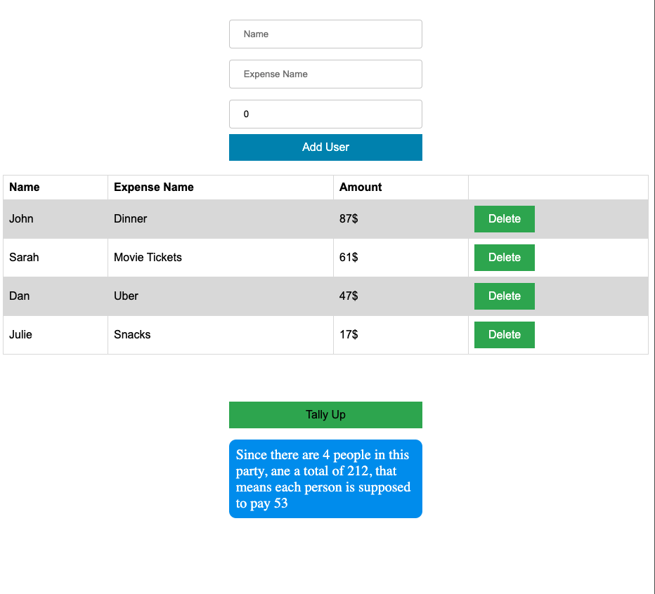

# Tally Up

This is a light version of the Splitwise app. Splitwise is a calculator app that takes in a bunch of shared expenses (dinner, movie, cab…) and names of participants, and spits out how much each participant owes at the end.

## Prerequisites

You will need the following things properly installed on your computer.

- [Git](https://git-scm.com/)
- [Node.js](https://nodejs.org/) (with npm)
- [Ember CLI](https://ember-cli.com/)
- [Google Chrome](https://google.com/chrome/)

## Installation

- `git clone https://github.com/YazanAlmatar99/TallyUp` this repository
- `cd TallyUp`
- `npm install`

## Running / Development

- `ember serve`
- Visit your app at [http://localhost:4200](http://localhost:4200).
- Visit your tests at [http://localhost:4200/tests](http://localhost:4200/tests).

### Code Generators

Make use of the many generators for code, try `ember help generate` for more details

### Running Tests

- `ember test`
- `ember test --server`

### Linting

- `npm run lint:hbs`
- `npm run lint:js`
- `npm run lint:js -- --fix`

### Building

- `ember build` (development)
- `ember build --environment production` (production)

### Deploying

Specify what it takes to deploy your app.

## Further Reading / Useful Links

- [ember.js](https://emberjs.com/)
- [ember-cli](https://ember-cli.com/)
- Development Browser Extensions
  - [ember inspector for chrome](https://chrome.google.com/webstore/detail/ember-inspector/bmdblncegkenkacieihfhpjfppoconhi)
  - [ember inspector for firefox](https://addons.mozilla.org/en-US/firefox/addon/ember-inspector/)
